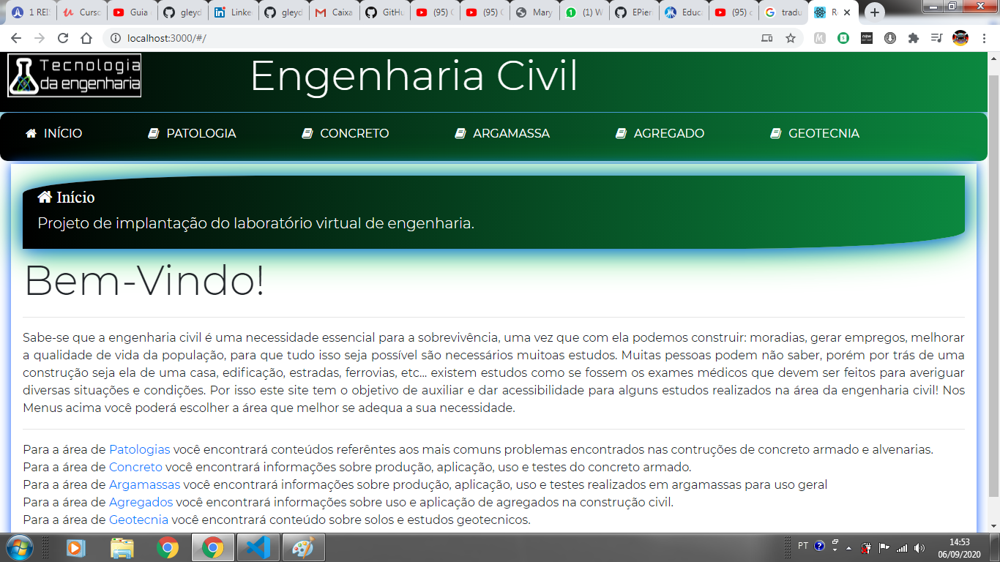

# Página inicial (imagem)

Página inicial (preview)

# Frontend para um site voltado para minha área de formação

Enfrentei alguns desafios neste desenvolvimento, pois é o meu primeiro projeto solo em React.

Ainda pretendo fazer alterações principalmente na parte de responsividade, mas a parte desktop era isso que eu gostaria de apresentar.

# Start o projeto

Para abrir o projeto utilize: 
    * npm i - para instalação das dependências
    * npm start - rodando o prjeto na porta localahost: 3000

# Próximos passos

* Melhorar a responsividade;
* Adicionar conteúdo real sobre os assuntos;
* Adicionar interatividade;
* Adicionar funcionalidades para estudantes e profissionais da área;

This project was bootstrapped with [Create React App](https://github.com/facebook/create-react-app).
